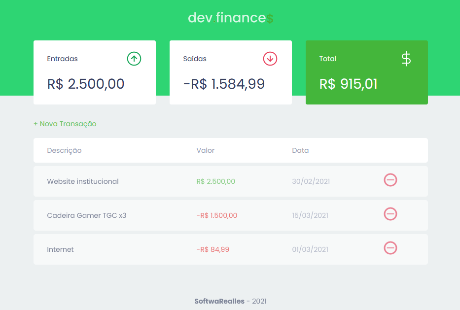
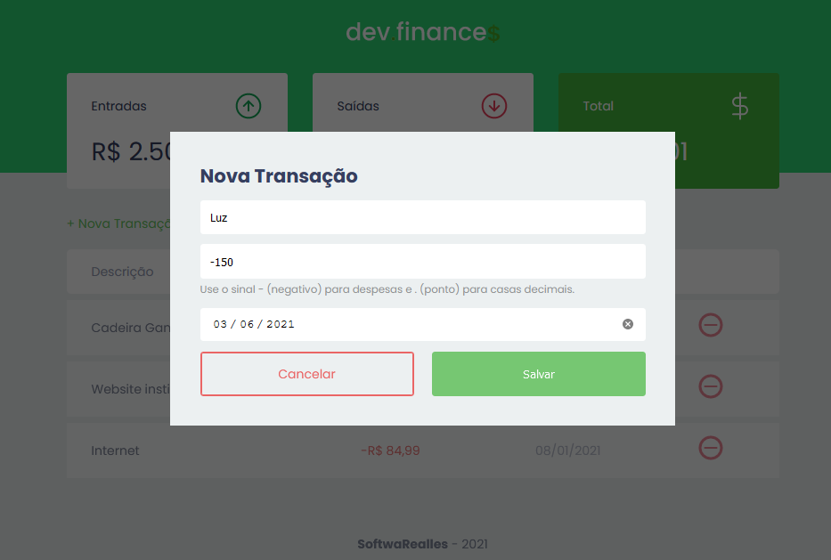
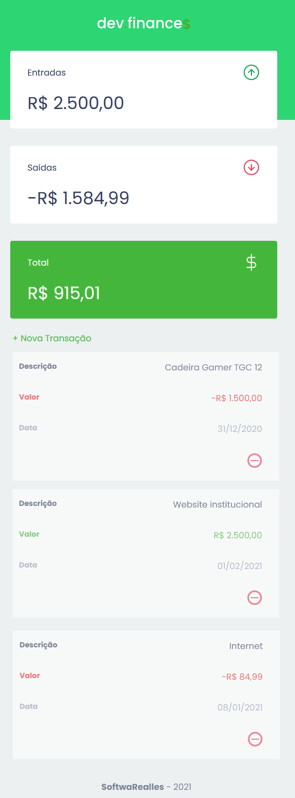

# Rocketseat - Maratona Discover #01
Este é um projeto desenvolvido no curso [Rocketseat - Maratona Discover #01](https://app.rocketseat.com.br/node/maratona-discover-edicao-01).

## Table of contents
- [Overview](#overview)
  - [The challenge](#the-challenge)
  - [Screenshot](#screenshot)
- [My process](#my-process)
  - [Built with](#built-with)
  - [What I learned](#what-i-learned)
- [Author](#author)
- [Acknowledgments](#acknowledgments)

## Overview

### The challenge
Aplicação permite os usuários:

- Ver layout otimizado independente do dispositivo e tamanho de telas.
- Adiciona e remover renda e despesas.
- Registro fica guardado via localStorage do browser.

### Screenshot




## My process

### Built with
- HTML5 semânctico
- CSS propriedades customizadas
- Flexbox
- SCSS
- JS/ES6+

### What I learned
HTML5 com Acessibilidade
Aplicar content: attr(data-label) via css para tabela responsiva.

```html
<h2 class="sr-only">Transações</h2>
```

```css
	.data-table td:before{
		content: attr(data-label);
		position: absolute;
		left: 0;
		width: 50%;
		padding-left: .9em;
		font-weight: bold;
		font-size: .85em;
		text-align: left;
	}
```

```js
	innerHTMLTransaction(transaction, index){
		let cssClass = transaction.amount > 0 ? 'income' : 'expense';
		let amount = Utils.formatCurrency(transaction.amount);
		let html = `
			<td data-label="Descrição" class="description">${transaction.description}</td>
			<td data-label="Valor" class="${cssClass}">${amount}</td>
			<td data-label="Data" class="date">${transaction.date}</td>
			<td></td>
		`;

		return html;
	},
```

## Author
- Rocketseat Perfil - [@SoftwaRealles](https://app.rocketseat.com.br/me/softwarealles)
- Facebook - [@SoftwaRealles](https://www.facebook.com/softwarealles)
- Github - [@SoftwaRealles](https://github.com/SoftwaRealles)

## Acknowledgments
Agradecer a Rocketseat por disponibilizar esse conteúdo para poder praticar e desenvolver skills de Front-End.
